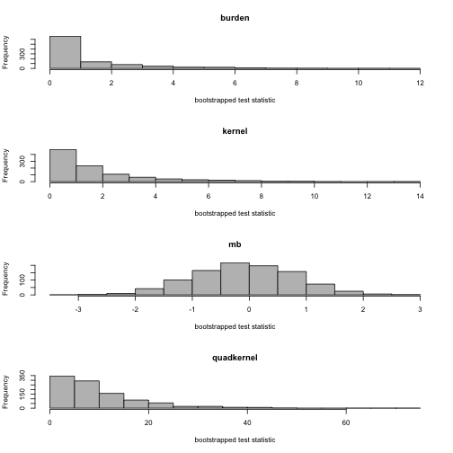

# 02-roxy-amritaPackage.Rmd

trunk/projects/amrita/08-gail-rethinking/08-clean-up-first/02-getting-started-roxy/02-roxy-amritaPackage.Rmd


```r
library(roxyPackage)
```

```
## Loading required package: roxygen2 Loading required package: digest
## Loading required package: tools Loading required package: XiMpLe
```

```r
pck.description = data.frame(Package = "amritaPackage", Type = "Package", Title = "Quasi-bootstrap association tests", 
    Author = "Amrita Ray <amray@stanford.edu>", AuthorsR = "c(person(given=\"Amrita\", family=\"Ray\",\n   email=\"amray@stanford.edu\", role=c(\"aut\", \"cre\")))", 
    Maintainer = "Amrita Ray <amray@stanford.edu>", Depends = "R (>= 2.10.0), kinship2, matrixcalc", 
    Description = "Provides quasi-bootstrap p-values for provided and user-provided tests.", 
    License = "GPL (>= 3)", Encoding = "UTF-8", LazyLoad = "yes", URL = "http://stanford.edu/~amray/thepackage/index.html", 
    stringsAsFactors = FALSE)
```


```r
roxy.package(pck.source.dir = "amritaPackage", pck.version = "0.01-1", R.libs = "~/R", 
    repo.root = "repo", pck.description = pck.description, actions = c("roxy", 
        "cite", "doc", "html", "license", "log", "win", "macosx", "package"), 
    ChangeLog = list(edited = c("I added Windows version")))
```

```
## R environment R.home:
## /Library/Frameworks/R.framework/Versions/3.0/Resources R.libs: ~/R
## license: saved a copy of the GNU General Public License (GPL) as LICENSE
## roxy: updated
## /Users/amray/Quasi-bootstrap/01-2013-09-28-software-draft/amritaPackage/R/amritaPackage-package.R.
## Loading required package: kinship2 Loading required package: Matrix
## Loading required package: lattice Loading required package: quadprog
## Loading required package: matrixcalc
```

```
## Updating collate directive in  /Users/amray/Quasi-bootstrap/01-2013-09-28-software-draft/amritaPackage/DESCRIPTION
```

```
## cite: updated
## /Users/amray/Quasi-bootstrap/01-2013-09-28-software-draft/amritaPackage/inst/CITATION.
## cite: updated
## /Users/amray/Quasi-bootstrap/01-2013-09-28-software-draft/repo/pckg/amritaPackage/citation.html.
## log: ChangeLog is up-to-date, skipped repo: copied
## amritaPackage_0.01-1.tar.gz to src/contrib. build: built and installed
## package Processing packages:
## /Users/amray/Quasi-bootstrap/01-2013-09-28-software-draft/repo/src/contrib/amritaPackage_0.01-1.tar.gz
## done repo: updated src/contrib/PACKAGES (source) pckg: updated ChangeLog
## build: created PDF docs repo: created amritaPackage_0.01-1.zip (windows)
## Processing packages:
## /Users/amray/Quasi-bootstrap/01-2013-09-28-software-draft/repo/bin/windows/contrib/3.0/amritaPackage_0.01-1.zip
## done repo: updated bin/PACKAGES (windows) repo: created
## amritaPackage_0.01-1.tgz (mac OS X) Processing packages:
## /Users/amray/Quasi-bootstrap/01-2013-09-28-software-draft/repo/bin/macosx/leopard/contrib/3.0/amritaPackage_0.01-1.tgz
## done repo: updated bin/PACKAGES (mac OS X) html: updated
## /Users/amray/Quasi-bootstrap/01-2013-09-28-software-draft/repo/pckg/amritaPackage/index.html
## html: updated pckg index
## /Users/amray/Quasi-bootstrap/01-2013-09-28-software-draft/repo/pckg/index.html
## html: updated global index
## /Users/amray/Quasi-bootstrap/01-2013-09-28-software-draft/repo/index.html
```


```r
library(amritaPackage, lib.loc = "~/R")
ls(2)
```

```
##  [1] "bootstrap_fn"                  "burden_statistic_fn"          
##  [3] "C_fn"                          "kernel_statistic_fn"          
##  [5] "kinship_fn"                    "mb_statistic_fn"              
##  [7] "p_hat_fn"                      "quadratic_kernel_statistic_fn"
##  [9] "r_hat_fn"                      "weight_fn"
```

```r
data(example_data)
# ?bootstrap_fn example(bootstrap_fn) ?burden_statistic_fn
# example(burden_statistic_fn)
N_bootstrap_reps = 1000
ped_object
```

```
##    ped_id  id father_id mother_id sex case_control
## 1       1 101         0         0   2            0
## 2       1 102         0         0   1            1
## 3       1 103       102       101   2            1
## 4       1 104       102       101   2            1
## 5       2 201         0         0   2            0
## 6       2 202         0         0   1            0
## 7       2 203       202       201   2            1
## 8       2 204       202       201   2            1
## 9       3 301         0         0   2            0
## 10      3 302         0         0   1            1
## 11      3 303       302       301   2            0
## 12      3 304       302       301   2            1
## 13      4 401         0         0   2            1
## 14      4 402         0         0   1            0
## 15      4 403       402       401   2            0
## 16      4 404       402       401   2            1
## 17      5 501         0         0   2            0
## 18      5 502         0         0   1            1
## 19      5 503       502       501   2            1
## 20      5 504       502       501   2            1
```

```r
geno_object
```

```
##     V1 V2 V3 V4
## 1  101  0  0  0
## 2  102  0  0  0
## 3  103  0  0  0
## 4  104  0  0  0
## 5  201  0  0  0
## 6  202  0  0  0
## 7  203  0  0  0
## 8  204  0  0  0
## 9  301  1  1  1
## 10 302  0  0  0
## 11 303  0  1  1
## 12 304  0  1  1
## 13 401  0  0  1
## 14 402  1  1  1
## 15 403  0  0  1
## 16 404  0  0  0
## 17 501  1  1  1
## 18 502  0  0  0
## 19 503  0  0  0
## 20 504  0  0  0
```

```r
map_object
```

```
##   name chr    bp weight
## 1 SNP1   1 10000      1
## 2 SNP2   1 10100      1
## 3 SNP3   1 10200      1
```

```r
genotype = geno_object[, 2:ncol(geno_object)]
test_statistic_fns = list(burden = burden_statistic_fn, kernel = kernel_statistic_fn, 
    mb = mb_statistic_fn, quadkernel = quadratic_kernel_statistic_fn)

bbb = bootstrap_fn(N_bootstrap_reps, genotype, ped_object, test_statistic_fns, 
    map_object)
names(bbb)
```

```
## [1] "observed"       "bootstrap_reps" "p_value"
```

```r
bbb$observed
```

```
##   burden kernel     mb quadkernel
## 1   6.56  7.554 -1.929       57.2
```

```r
bbb$p_value
```

```
##   burden kernel    mb quadkernel
## 1  0.017  0.025 0.982      0.003
```

```r
par(mfrow = c(4, 1))
invisible(lapply(names(bbb$bootstrap_reps), function(name) {
    this = bbb$bootstrap_reps[[name]]
    hist(this, col = "gray", main = name, xlab = "bootstrapped test statistic")
}))
```

 


